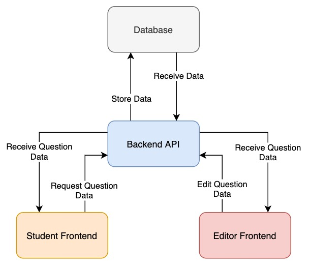
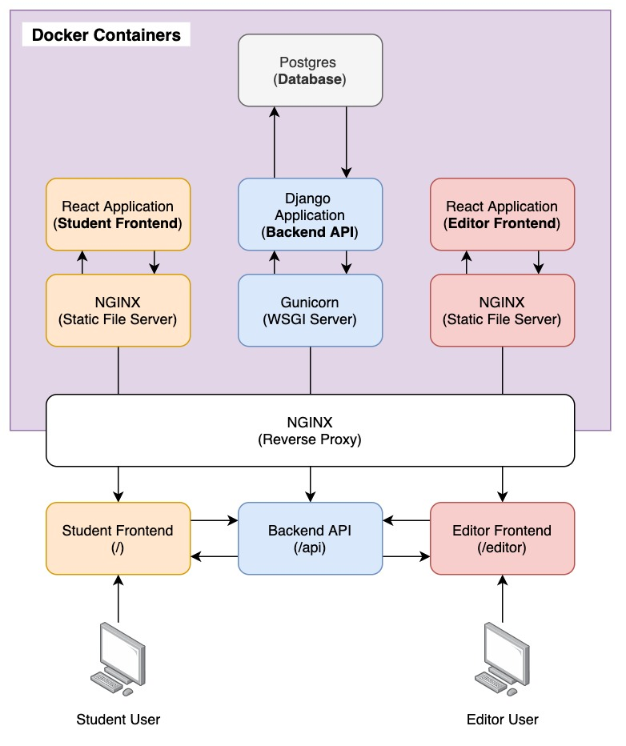

# AutoEd Architecture Overview

This document explores the architecture that makes up AutoEd.

## General Overview

AutoEd is a web platform for automated marking defined by four main components:

- **The Student Frontend:** Students can load the Student Frontend in their browsers and complete a question. Questions can potentially take the form of multiple choice, coding, or other defined templates (such as ER diagramming questions). After finishing a question, students will be able to submit to question for automated grading by AutoEd.
- **The Editor Frontend:** Teachers, TAs, or other administrative personnel involved in a educational content, can use the Editor Frontend to edit or create questions for students to complete. Creating a question involves defining a question template (HTML/CSS/JS) and creating questions using the template.
- **The Backend API:** Both frontends use the backend API to retrieve question information and submit question data. The Backend API communicates with the database to store and receive data relevant to AutoEd.
- **The Database:** All question and question template data is stored inside the database for retrieval by the Backend API.

## Technology Stack Overview

AutoEd's technology stack is hosted and deployed through Docker (specifically Docker's containers and docker-compose). Docker makes project setup much easier by handling the creation/spin-up of all technologies chosen by the developer. Instead of installing all dependencies manually on your machine, Docker creates miniature, lightweight virtual machines (AKA containers) and installs everything you need for your project inside them.
Docker Compose, on the other hand, allows for orchestration of multiple containers, which enables development/deployment of large (or small) web services in a reproducible manner.

AutoEd's tech stack is created as a 5 container service within Docker. The entire project can be deployed by running `docker-compose -f local.yml up` at the root of the project. Once all containers are started, a user developing on their local machine, for example, would be able to access the student frontend by navigating to `http://localhost`, the editor frontend by navigating to `http://localhost/editor`, and the API by sending POST or GET requests to `http://localhost/api`. The 5 containers running this service (and enabling accessibility) are: the `django` container, the `postgres` container, the `reverse_proxy` container, the `student` container, and the `editor` container. These containers and their functionality are discussed below.

### Container: django

This container hosts a Django application run through the Gunicorn WSGI server. The Django app communicates with frontend services through the exposed routes to form the Backend API for AutoEd. (This container contains all blue blocks in the above diagram inside the purple docker block)

### Container: postgres

This container hosts the Postgres database for AutoEd. The Postgres instance contained isn't generally accessible outside of Docker. Only the Django application can communicate with it. (This container contains all grey blocks in the above diagram inside the purple docker block)

### Container: student

This container hosts a static website through NGINX as a platform for students to complete questions. The static website queries the Backend API for questions through a GET request. The returned data is rendered to the user's browser. (This container contains all orange blocks in the above diagram inside the purple docker block)

### Container: editor

This container hosts the React application which enables creating/editing questions and question templates. The React application accomplishes user authentication and question create/edit operations through the Backend API. (This container contains all red blocks in the above diagram inside the purple docker block)

### Container: reverse_proxy

This container hosts an NGINX server which maps external URLs to internal Docker container services. This container effectively proxies requests to containers inside Docker. Mappings are listed below (replace SITE_URL with the URL AutoEd is being hosted at, whether localhost or an official domain):

| Container | Internal Docker URL | External URL |
| - | - | - |
| django | http://django:8000 | http://SITE_URL/api |
| postgres | http://postgres:5432 | N/A |
| student | http://student:9000 | http://SITE_URL/ |
| editor | http://editor:7000 | http://SITE_URL/editor |
