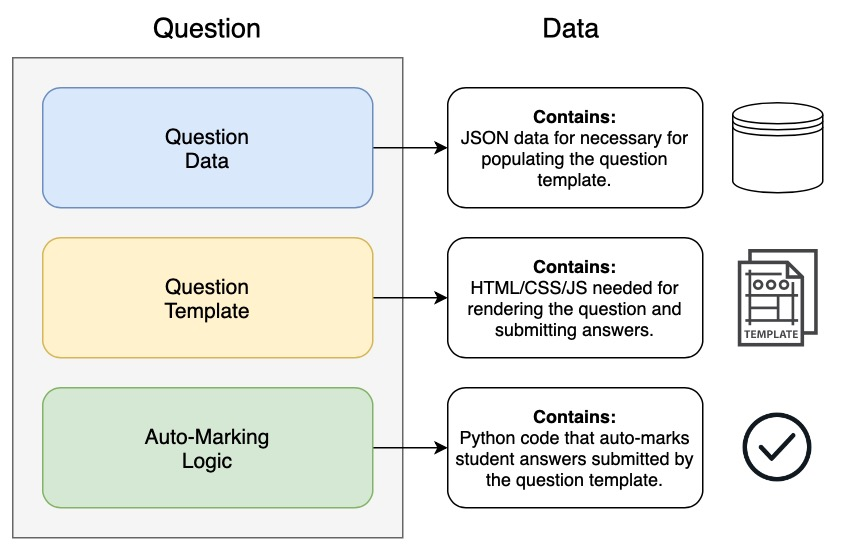
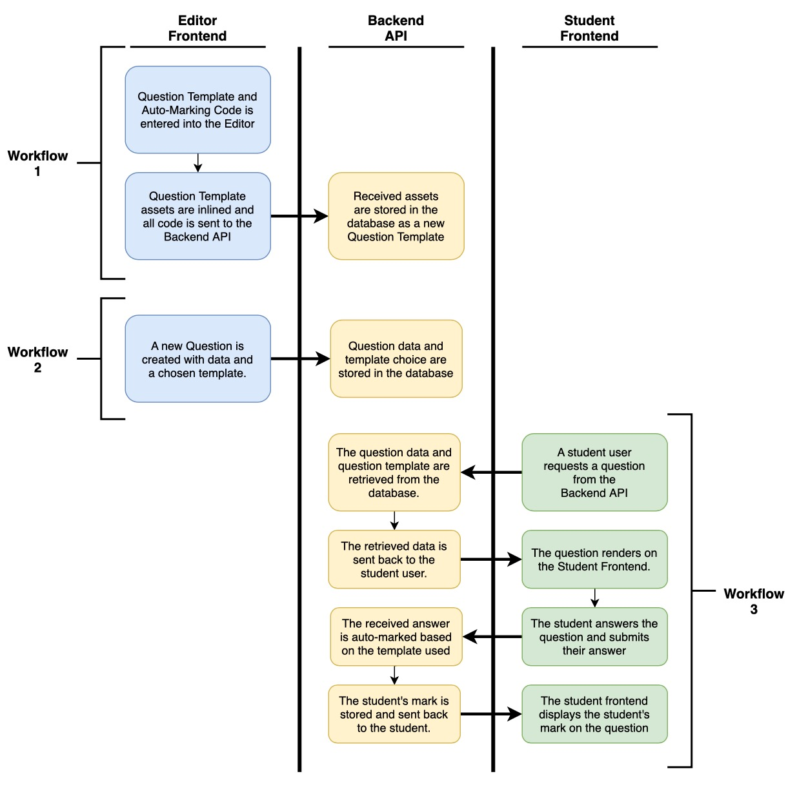

# Data Lifecycle

## Question Composition

The majority of functionality within AutoEd is centered around interactions involving questions. Students can answer questions through the Student Frontend, editors (professors, TAs, etc) can edit or create questions using the Editor Frontend, and all submitted answers are auto-marked using the Backend API. To facilitate this behaviour, we define a question as a concept composed of three pieces of data, which we expand upon in the diagram and explanations below:

**Question Data:** A JSON object containing data specific to this single question. The data must be readable/usable by the question template linked to the question. For instance, a multiple choice question might have a JSON object containing the list of choices of the question. The question template would take this JSON object as input and render the appropriate multiple choice question.

**Question Template:** A string-based representation of the HTML, CSS, and JavaScript elements required for rendering the question template to the Student Frontend. The question template accepts data, when rendered to the frontend, for question population and enables answer submission to the Backend API.

**Auto-Marking Logic:** A string-based presentation of Python code capable of accepting question answers submitted by the question template and auto-marking them.

## Question Lifecycle

The above diagram details the process of creating and answering a question in chronological order.

### Question Creation and Editing

Creating and editing a question involves, first, creating a Question Template and defining auto-marking logic (workflow 1 in the above diagram). This is a necessary first step since a template must exist before question data (specific to a template) can be entered.

Defining a template involves a user uploading HTML, CSS, and JavaScript assets to the Editor Frontend. These assets are compiled down, on the frontend, to a set of HTML elements and stringified. CSS and JavaScript assets, specifically, are converted to inline HTML elements and appeneded to the bottom of the overall HTML element bundle. A user must also define Python 3 code detailing auto-marking logic for submitted student answers (which is also stringified). These assets are subsequently POSTed to the Backend API for storage (`/template` API endpoint).

Defining a question involves linking the new question with an existing template, uploading question data (specific to the selected template) to the Editor Frontend, and POSTing this data to the Backend API.

Please refer to the Question Standards Document before creating a new Question Template or Question.

### Question Answering and Auto-Marking

Question answering and auto-marking is a single process (workflow 3 in the above diagram) that involves the Student Frontend and the Backend API. This procedure is initiated with the Student frontend requesting a specific question's template and data through a GET request to the Backend API (`/question` API endpoint). This data is retrieved by the backend and sent back as a reply in JSON form. The Student Frontend subsequently renders the question template and passes the question data to the template.

After the user has submitted their answer, the question template POSTs all data to the Backend API for marking (`/answer` API endpoint). The Backend API subsequently retrieves the auto-marking code for marking submissions from the specified template and runs the code on the submission. Output from the code is stored, the submission's mark is POSTed back to the user, and the Student Frontend renders the result of the submission.

### Notes on the template and injection of question data
The template will have an will have a "injectQuestionData(questionData)" function. 
This function will be called by the student Frontend because it will be in the global JS scope of the webpage and pass it to the question data. 
